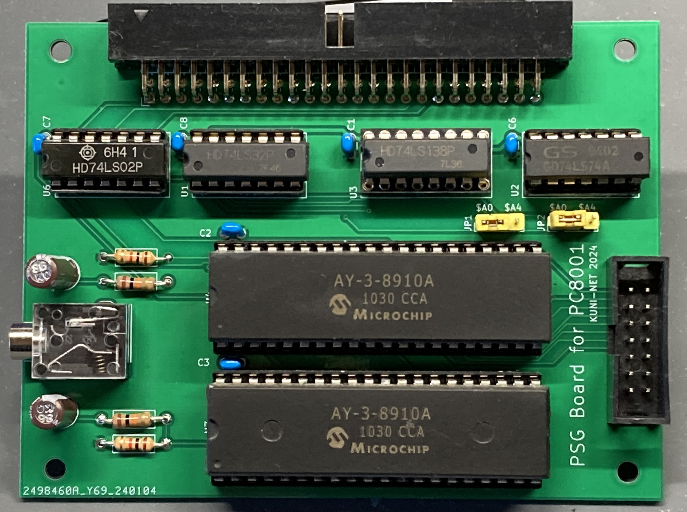
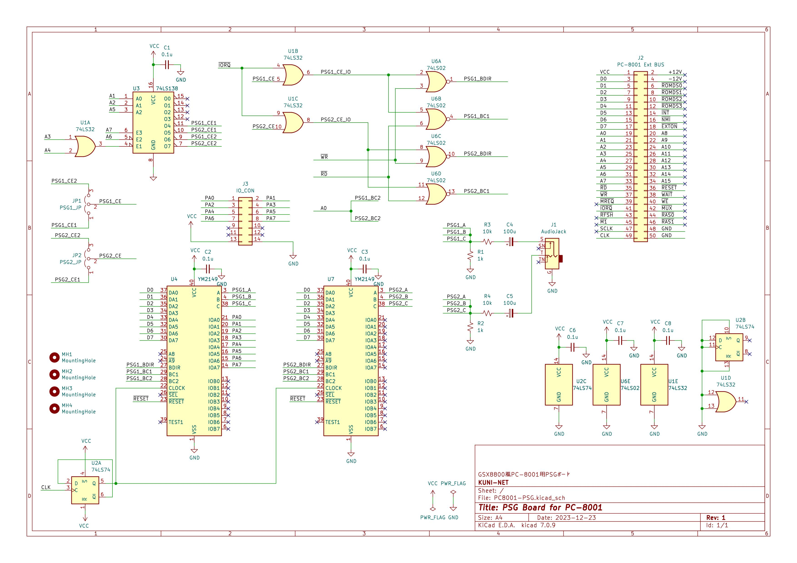

# PC8001-PSG (GSX8800風PSG音源ボード)

## 概要

* PC-8001用のPSGを2個搭載したボードです。
* I/OアドレスはGSX8800風(0A0h-0A3h or 0A4h-0A7h)にしてます。

  |I/Oアドレス|説明|
  |:--|:--|
  |0A0h(0A4h)|PSG#1 レジスタ番号|
  |0A1h(0A5h)|PSG#1 データ|
  |0A2h(0A6h)|PSG#1 レジスタ番号|
  |0A3h(0A7h)|PSG#1 データ|

## 回路図

## ジャンパ設定

* I/Oアドレスを変更することが可能です。

  |JP|1-2|2-3|
  |:--|:--|:--|
  |JP1(PSG#1)|0A0h-0A1h|0A4h-0A5h|
  |JP2(PSG#2)|0A2h-0A3h|0A6h-0A7h|

## 部品表

[KiCad/PC8001-PSG.csv](KiCad/PC8001-PSG.csv)

## 参考URL

* https://piclabo.blog.ss-blog.jp/Simple8Z_PSG
  * SuperSimpleController（その２１）PSG(AY-3-8910A)の動作確認

